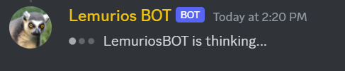
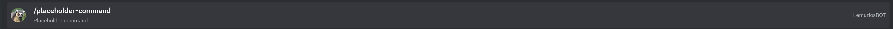

## Lemurios Discord BOT Guide

---

### To Add to your server you can use this link:
 - [Bot Invite Link](https://discord.com/oauth2/authorize?client_id=1096774404526063687&permissions=2184226816&redirect_uri=https%3A%2F%2Fdiscordapp.com%2Foauth2%2Fauthorize%3F%26client_id%3D1096774404526063687%26scope%3Dbot&response_type=code&scope=voice%20connections%20bot)
 - Approve the requested rights and accesses.

### Build & Run:
Build: mvn clean package
Run: mvn spring-boot:run
---
### Overview:
The commands currently available:
 - ASSEMLEMURS_COMMAND / calls all members of the LEMURIOI role
 - CREDITS_COMMAND / shows the credits
 - HELP_COMMAND / shows all available commands
 - PLAY_COMMAND / the bot will join the channel that the caller is in and then plays the audio of the provided URL, works with most CDNs (like discords or facebook's) and youtube
 - SET_RADIO / The bot will save a URL and a genre for later retrieval, works with the /get-radio :genre command.
 - GET_RADIO / the bot will join the channel that the caller is in and then plays the audio of the provided URL, works with most CDNs (like discords or facebook's) and youtube
 - DELETE_ALL / the bot will delete all urls for the server
 - DELETE_GENRE / the bot will delete the urls for a specific genre server
 - PAUSE_COMMAND / pauses the bot
 - RESUME_COMMAND / unpauses the bot
 - SKIP_COMMAND / skips current track
 - STOP_COMMAND / completely stops current track and removes following tracks from the queue
 - JOIN_COMMAND / the bot will join the voice channel the caller is in
 - NOW_PLAYING / shows information about the current track playing
 - MEME_COMMAND / bot returns a random meme that the server hasn't seen. 
 - HISTORY_COMMAND / shows the last commands executed
 - TAKEN_NAMES / shows the taken names of Lemurioi
 - UPLOAD_MEME_COMMAND / lets the user upload a meme to the bot so it can be served later
 - DETECT_IMAGE_EDGES_COMMAND / the user uploads an image and the bot will return a bnw image with the detected edges 
 - DISCONNECT_COMMAND / disconnects the bot from the voice channel
 - LEADERBOARD_COMMAND / shows the leaderboard for the guild
 - SCHEDULE_COMMAND / [Work in progress]

---
   
 

### Technical Overview:

To improve code re-usability and tidiness we opted to use a java abstract class called Command. Also, we made these commands
act as beans. 

During startup all beans get instantiated and are added to a map where the key is the command name. The command name is taken by an enum which is shared both by the map and the commands that are identified by the bot during the startup.


Please find below a list of all the beans used in the application:
 * LemuriosBOT.java - @Component
   * Responsible for registering the slash interaction commands and map them to java beans/Commands. 
     When a Slash Interaction event arrives is picked up by the BOT, the bot will initially reply. During the initial reply, the bot will appear with the:

    
 * Command.java - @Service
   * Abstract class which holds all basic functionality of the commands.
 * AssemblemursCommand.java - @Service
   * Chat command that sends a direct message to each online member of the 'Lemurioi' discord role and also does a ping in the chat for that role.
 * CreditsCommand.java - @Service
   * Chat command that shows the credits and the version.
 * HelpCommand.java - @Service
   * Chat command that prints all commands available.
 * HistoryCommand.java - @Service
   * Chat command that prints the last 25 commands.
 * Leaderboard.java @Service
    * Chat command shows the leaderboard for the server the command was executed on.
 * TakenNamesCommand.java - @Service
   * Chat command that prints the taken Lemurios XXX names.
 * DetectImageEdgesCommand.java - @Service
   * Chat command that uploads a picture to the BOT, and it will find its edges.
 * MemeCommand.java - @Service
   * Chat command that returns a random meme.
 * UploadMemeCommand.java - @Service
   * Chat command uploads a meme that can be uploaded by a user.
 * DisconnectCommand.java @Service
    * Chat command that disconnects the bot from the voice channel
 * JoinCommand.java - @Service
   * Chat command that summons the bot on the voice chat that the caller is in.
 * NowPlaying - @Service
   * Chat command that prints the song queue. 
 * PauseCommand.java - @Service
   * Chat command that pauses the Lemurios Music Bot.
 * PlayCommand.java - @Service
   * Chat command that adds a song to the queue and then plays it. 
 * ResumeCommand.java - @Service
   * Chat command that resumes the player if it is paused.
 * SkipCommand.java - @Service
   * Chat command that skips the current song playing.
 * StopCommand.java - @Service
   * Chat command that stops the execution of the player and removes the queue.
 * MusicPlayerManager.java - @Service
   * Class responsible for providing different instances of MusicPlayers to different guilds.
 * DataServiceImpl.java -@Service
   * Class responsible for database operations
 * LevelingServiceImpl.java - @Service
   * Class responsible for level/point progression
 * DiscordUtilsImpl.java - @Service
   * Class responsible for providing utilities like downloading images or getting an available filename
 * DeleteAllCustomRadioLinkCommand.java - @Service
   * Class responsible for deleting all links
 * DeleteGenreCustomRadioLinkCommand.java - @Service
   * Class responsible for deleting the link for a genre
 * GetCustomRadioLinkCommand.java - @Service
   * Class responsible for retrieving all persisted urls and their genres
 * PlayCustomRadioCommand.java - @Service
   * Class responsible for playing the radio for the link of the specified genre
 * SetCustomRadioLinkCommand.java - @Service
   * Class responsible for setting a URL and genre

**Finally, each command will be responsible for editing the initial reply and adding any information needed by the bot.**

---

### Example for extending the Command.java

```java
package bot.commands.concrete.placeholder;

import bot.commands.Command;
import net.dv8tion.jda.api.EmbedBuilder;
import net.dv8tion.jda.api.events.interaction.command.SlashCommandInteractionEvent;
import org.slf4j.Logger;
import org.slf4j.LoggerFactory;
import org.springframework.beans.factory.annotation.Autowired;
import org.springframework.stereotype.Service;

import java.awt.*;

@Service
public class PlaceHolderCommand extends Command {
    private static final Logger LOGGER = LoggerFactory.getLogger(PlaceHolderCommand.class);
    @Override
    public void execute(SlashCommandInteractionEvent event) {
        LOGGER.info("{} has requested the placeholder command - ENTER.", event.getUser().getName());
        //Embed builder can hold information such as title, description, color etc. 
        EmbedBuilder embedBuilder = new EmbedBuilder();
        embedBuilder.setTitle("LEMURIOS BOT - placeholder Command:")
                .setColor(Color.ORANGE)
                .setDescription("Lemurios bot placeholder description")
                .addField("Fields", "you can add fields with information", true)
                .setFooter("p.s. this is a foot");
        //DO other stuff here
        
        //Then grab the interaction hook and edit it by providing our newly created embed.
        event.getInteraction().getHook().editOriginalEmbeds(embedBuilder.build()).queue();
    }

    @Autowired
    public void setMusicPlayerManager(MusicPlayerManager musicPlayerManager) {
        this.musicPlayerManager = musicPlayerManager;
    }
    
   @Override
   public String getCommandDescription() {
      return "Enter a description here about the command.";
   }

   @Override
   public String getCommandName() {
      return PLACEHOLDER_COMMAND.getCommandName();
   }
}
```

Add the following to the Constants.java enum
```java
   PLACEHOLDER_COMMAND("placeholder-command"),
```

Then add the following on the LemuriosBOT.java:
```java
    //Add the bean declaration:
    private PlaceHolderCommand placeHolderCommand;
    @Autowired
    public void setPlaceHolderCommand(PlaceHolderCommand placeHolderCommand){
        this.placeHolderCommand = placeHolderCommand;
    }
    //define the JDA Command under the onGuildReady() method.
        commandData.add(Commands.slash(PLACEHOLDER_COMMAND.getValue(), "Placeholder command"));
    //add on the init() method the following:
        commands.put(PLACEHOLDER_COMMAND.getValue(), placeHolderCommand);

```

The command should be now available on the next startup:


### More on Commands:
 - Guild Commands: these commands get instantly deployed. These are the commands under the onGuildReady() method.
 - Global Commands: for production use and takes up to 1 hour to get deployed on the discord's backend. These commands are defined in the onReady() method. {
 

### Known errors:
- sometimes lava player crashes when loading a youtube links
### Guides:
 * [Lave player](https://github.com/sedmelluq/LavaPlayer#jda-integration)
 * [JDA Wiki Tutorial](https://jda.wiki/using-jda/making-a-music-bot/)
 

